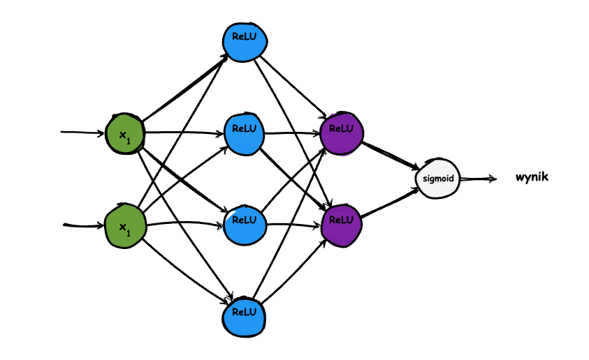

#ai #mlp #ffn

## Równania Matematyczne Sieci Neuronowej (tylko przebieg do przodu, inferencja)



### Założenia: 
Załóżmy następujące wagi i biasy (wartości są zmyślone):

1. **Pierwsza warstwa ukryta:**
   
   - Wagi $\mathbf{W}_1$ (pierwsza macierz pomiędzy wejściowymi sygnałami i 4 neuronami ReLU):
     $$
     \mathbf{W}_1 = \begin{pmatrix}
     0.2 & 0.8 \\
     0.6 & -0.5 \\
     -0.3 & 0.1 \\
     0.4 & 0.7
     \end{pmatrix}
     $$
   - Biasy $\mathbf{b}_1$:

     $$
     \mathbf{b}_1 = \begin{pmatrix}
     0.1 \\
     -0.2 \\
     0.3 \\
     -0.4
     \end{pmatrix}
     $$

2. **Druga warstwa ukryta:**
   - Wagi $\mathbf{W}_2$:
     $$
     \mathbf{W}_2 = \begin{pmatrix}
     0.5 & -0.4 & 0.3 & 0.1 \\
     -0.2 & 0.7 & -0.1 & 0.6
     \end{pmatrix}
     $$
   - Biasy $\mathbf{b}_2$:
     $$
     \mathbf{b}_2 = \begin{pmatrix}
     0.2 \\
     -0.1
     \end{pmatrix}
     $$

3. **Warstwa wyjściowa:**
   - Wagi $\mathbf{W}_3$:
     $$
     \mathbf{W}_3 = \begin{pmatrix}
     0.3 & -0.6
     \end{pmatrix}
     $$
   - Bias $b_3$:
     $$
     b_3 = 0.1
     $$

### Obliczenia propagacji w przód:

1. **Pierwsza warstwa ukryta:**
   - Wejście: $\mathbf{x} = [1, 1]$ - taki wektor na wejściu oznacza, że mamy dwie prawdy w wektorze wejściowym:```[True, True]```

   - Oblicz $\mathbf{z}_1 = \mathbf{W}_1 \mathbf{x} + \mathbf{b}_1$:
   
     $$
     \mathbf{z}_1 = \begin{pmatrix}
     0.2 & 0.8 \\
     0.6 & -0.5 \\
     -0.3 & 0.1 \\
     0.4 & 0.7
     \end{pmatrix} \begin{pmatrix} 1 \\ 1 \end{pmatrix} + \begin{pmatrix}
     0.1 \\
     -0.2 \\
     0.3 \\
     -0.4
     \end{pmatrix} = \begin{pmatrix}
     0.2 \cdot 1 + 0.8 \cdot 1 + 0.1 \\
     0.6 \cdot 1 + (-0.5) \cdot 1 - 0.2 \\
     (-0.3) \cdot 1 + 0.1 \cdot 1 + 0.3 \\
     0.4 \cdot 1 + 0.7 \cdot 1 - 0.4
     \end{pmatrix} = \begin{pmatrix}
     1.1 \\
     -0.1 \\
     0.1 \\
     0.7
     \end{pmatrix}
     $$
   - Zastosuj funkcję aktywacji ReLU: $\mathbf{a}_1 = \text{ReLU}(\mathbf{z}_1)$:
     $$
     \mathbf{a}_1 = \begin{pmatrix}
     \text{ReLU}(1.1) \\
     \text{ReLU}(-0.1) \\
     \text{ReLU}(0.1) \\
     \text{ReLU}(0.7)
     \end{pmatrix} = \begin{pmatrix}
     1.1 \\
     0 \\
     0.1 \\
     0.7
     \end{pmatrix}
     $$

2. **Druga warstwa ukryta:**
   - Oblicz $\mathbf{z}_2 = \mathbf{W}_2 \mathbf{a}_1 + \mathbf{b}_2$:
     $$
     \mathbf{z}_2 = \begin{pmatrix}
     0.5 & -0.4 & 0.3 & 0.1 \\
     -0.2 & 0.7 & -0.1 & 0.6
     \end{pmatrix} \begin{pmatrix} 1.1 \\ 0 \\ 0.1 \\ 0.7 \end{pmatrix} + \begin{pmatrix}
     0.2 \\
     -0.1
     \end{pmatrix} =
     $$
     $$ 
     = \begin{pmatrix}
     0.5 \cdot 1.1 + (-0.4) \cdot 0 + 0.3 \cdot 0.1 + 0.1 \cdot 0.7 + 0.2 \\
     -0.2 \cdot 1.1 + 0.7 \cdot 0 + (-0.1) \cdot 0.1 + 0.6 \cdot 0.7 - 0.1
     \end{pmatrix} = 
     $$
     $$
     =\begin{pmatrix}
     0.5 \cdot 1.1 + 0.3 \cdot 0.1 + 0.1 \cdot 0.7 + 0.2 \\
     -0.2 \cdot 1.1 + (-0.1) \cdot 0.1 + 0.6 \cdot 0.7 - 0.1
     \end{pmatrix} = \begin{pmatrix}
     0.55 + 0.03 + 0.07 + 0.2 \\
     -0.22 - 0.01 + 0.42 - 0.1
     \end{pmatrix} = \begin{pmatrix}
     0.85 \\
     0.09
     \end{pmatrix}
     $$
   - Zastosuj funkcję aktywacji ReLU: $\mathbf{a}_2 = \text{ReLU}(\mathbf{z}_2)$:
     $$
     \mathbf{a}_2 = \begin{pmatrix}
     \text{ReLU}(0.85) \\
     \text{ReLU}(0.09)
     \end{pmatrix} = \begin{pmatrix}
     0.85 \\
     0.09
     \end{pmatrix}
     $$

3. **Warstwa wyjściowa:**
   - Oblicz $z_3 = \mathbf{W}_3 \mathbf{a}_2 + b_3$:
     $$
     z_3 = 0.3 \cdot 0.85 + (-0.6) \cdot 0.09 + 0.1 = 0.255 - 0.054 + 0.1 = 0.301
     $$
   - Zastosuj funkcję aktywacji sigmoid: $\hat{y} = \sigma(z_3)$:
     $$
     \hat{y} = \sigma(0.301) = \frac{1}{1 + e^{-0.301}} \approx 0.5747
     $$

### Podsumowanie obliczeń:
- **Pierwsza warstwa ukryta:**
  - $\mathbf{z}_1 = \begin{pmatrix} 1.1 \\ -0.1 \\ 0.1 \\ 0.7 \end{pmatrix}$
  
  - $\mathbf{a}_1 = \begin{pmatrix} 1.1 \\ 0 \\ 0.1 \\ 0.7 \end{pmatrix}$

- **Druga warstwa ukryta:**
  - $\mathbf{z}_2 = \begin{pmatrix} 0.85 \\ 0.09 \end{pmatrix}$
  
  - $\mathbf{a}_2 = \begin{pmatrix} 0.85 \\ 0.09 \end{pmatrix}$

- **Warstwa wyjściowa:**
  - $z_3 = 0.301$
  
  - $\hat{y} = 0.5747$

Ten wynik $\hat{y} \approx 0.5747$ jest wyjściem sieci neuronowej dla wektora wejściowego $[1, 1]$ z podanymi losowymi wagami i biasami.
Zwróćcie uwagę jak te obliczenia szybko eskalują. Mama na myśli to, że nawet przy tak prostej sieci ilość małych kroków obliczeniowych prowadzących do wyniku (wyjścia z sieci) jest duża. Współczesne sieci, stojące za dużymi modelami językowymi, są miliardy razy bardziej złożone. Zasoby obliczeniowe potrzebne do ich wytrenowania muszą być gargantuiczne. W tej nowej perspektywie obliczeniowej zależny nam na równoległym wykonywaniu miliardów niezbyt precyzyjnych obliczeń.  


Oczywiście! Oto równania zagnieżdżone w formacie LaTeX do użycia w Markdown, z uwzględnieniem, że pierwsza macierz ma wymiary \(2 \times 4\), druga \(4 \times 2\) i trzecia \(2 \times 1\):


# Równanie sieci bez podstawień
- Tym razem nie podstawiam konkretnych wartości za wyrażenia w macierzach;
- Bardziej abstrakcyjne i uniwersalne ujęcie wielowarstwowego perceptronu
### Definicje:
- Niech $\mathbf{x} = [x_1, x_2]^T$ będzie wektorem wejściowym.
- Niech $\mathbf{W_1}$ będzie macierzą wag pomiędzy warstwą wejściową a pierwszą warstwą ukrytą.
- Niech $\mathbf{b_1}$ będzie wektorem biasów dla pierwszej warstwy ukrytej.
- Niech $\mathbf{h_1}$ będzie aktywacjami pierwszej warstwy ukrytej.
- Niech $\mathbf{W_2}$ będzie macierzą wag pomiędzy pierwszą a drugą warstwą ukrytą.
- Niech $\mathbf{b_2}$ będzie wektorem biasów dla drugiej warstwy ukrytej.
- Niech $\mathbf{h_2}$ będzie aktywacjami drugiej warstwy ukrytej.
- Niech $\mathbf{W_3}$ będzie macierzą wag pomiędzy drugą warstwą ukrytą a warstwą wyjściową.
- Niech $\mathbf{b_3}$ będzie biasem dla warstwy wyjściowej.
- Niech $\mathbf{y}$ będzie wyjściem sieci neuronowej.

### 1. Warstwa wejściowa do pierwszej warstwy ukrytej:
Wyjście pierwszej warstwy ukrytej oblicza się za pomocą funkcji aktywacji ReLU:
$$ \mathbf{h_1} = \text{ReLU}(\mathbf{W_1} \mathbf{x} + \mathbf{b_1}) $$
gdzie:
$$ \text{ReLU}(z) = \max(0, z) $$

### 2. Pierwsza warstwa ukryta do drugiej warstwy ukrytej:
Wyjście drugiej warstwy ukrytej oblicza się za pomocą funkcji aktywacji ReLU:
$$ \mathbf{h_2} = \text{ReLU}(\mathbf{W_2} \mathbf{h_1} + \mathbf{b_2}) $$

### 3. Druga warstwa ukryta do warstwy wyjściowej:
Ostateczne wyjście sieci neuronowej oblicza się za pomocą funkcji aktywacji Sigmoid:
$$ \mathbf{y} = \text{Sigmoid}(\mathbf{W_3} \mathbf{h_2} + \mathbf{b_3}) $$
gdzie:
$$ \text{Sigmoid}(z) = \frac{1}{1 + e^{-z}} $$

### Macierze i wektory:
- $\mathbf{W_1}$ jest macierzą $2 \times 4$:
  $$ \mathbf{W_1} = 
  \begin{bmatrix}
  w_{11} & w_{12} & w_{13} & w_{14} \\
  w_{21} & w_{22} & w_{23} & w_{24}
  \end{bmatrix} $$

- $\mathbf{b_1}$ jest wektorem $4 \times 1$:
  $$ \mathbf{b_1} = 
  \begin{bmatrix}
  b_{11} \\
  b_{21} \\
  b_{31} \\
  b_{41}
  \end{bmatrix} $$

- $\mathbf{W_2}$ jest macierzą $4 \times 2$:
  $$ \mathbf{W_2} = 
  \begin{bmatrix}
  w_{11} & w_{12} \\
  w_{21} & w_{22} \\
  w_{31} & w_{32} \\
  w_{41} & w_{42}
  \end{bmatrix} $$

- $\mathbf{b_2}$ jest wektorem $2 \times 1$:
  $$ \mathbf{b_2} = 
  \begin{bmatrix}
  b_{12} \\
  b_{22}
  \end{bmatrix} $$

- $\mathbf{W_3}$ jest macierzą $2 \times 1$:
  $$ \mathbf{W_3} = 
  \begin{bmatrix}
  w_{11} \\
  w_{21}
  \end{bmatrix} $$

- $\mathbf{b_3}$ jest skalarem:
  $$ \mathbf{b_3} = b_3 $$

### Zagnieżdżone równanie:

Aby zagnieździć te równania, zastępujemy krok po kroku wewnętrzne równania w zewnętrznych:

1. Zastąpmy $\mathbf{h_1}$ w $\mathbf{h_2}$:
   $$ \mathbf{h_2} = \text{ReLU}(\mathbf{W_2} \text{ReLU}(\mathbf{W_1} \mathbf{x} + \mathbf{b_1}) + \mathbf{b_2}) $$

2. Zastąpmy $\mathbf{h_2}$ w $\mathbf{y}$:
   $$ \mathbf{y} = \text{Sigmoid}(\mathbf{W_3} \text{ReLU}(\mathbf{W_2} \text{ReLU}(\mathbf{W_1} \mathbf{x} + \mathbf{b_1}) + \mathbf{b_2}) + \mathbf{b_3}) $$

To pojedyncze zagnieżdżone równanie reprezentuje cały przepływ obliczeń w sieci neuronowej:

$$ \mathbf{y} = \text{Sigmoid}(\mathbf{W_3} \text{ReLU}(\mathbf{W_2} \text{ReLU}(\mathbf{W_1} \mathbf{x} + \mathbf{b_1}) + \mathbf{b_2}) + \mathbf{b_3}) $$

### Wyjaśnienie:

- **Najbardziej wewnętrzna część**: $\mathbf{W_1} \mathbf{x} + \mathbf{b_1}$ oblicza liniową kombinację wejść i wag plus bias dla pierwszej warstwy ukrytej.
- **Pierwsza ReLU**: $\text{ReLU}(\mathbf{W_1} \mathbf{x} + \mathbf{b_1})$ stosuje funkcję aktywacji ReLU do wyjścia pierwszej warstwy ukrytej.
- **Obliczenie drugiej warstwy**: $\mathbf{W_2} \text{ReLU}(\mathbf{W_1} \mathbf{x} + \mathbf{b_1}) + \mathbf{b_2}$ oblicza liniową kombinację dla drugiej warstwy ukrytej.
- **Druga ReLU**: $\text{ReLU}(\mathbf{W_2} \text{ReLU}(\mathbf{W_1} \mathbf{x} + \mathbf{b_1}) + \mathbf{b_2})$ stosuje funkcję aktywacji ReLU do wyjścia drugiej warstwy ukrytej.
- **Obliczenie warstwy wyjściowej**: $\mathbf{W_3} \text{ReLU}(\mathbf{W_2} \text{ReLU}(\mathbf{W_1} \mathbf{x} + \mathbf{b_1}) + \mathbf{b_2}) + \mathbf{b_3}$ oblicza liniową kombinację dla warstwy wyjściowej.
- **Sigmoid**: $\text{Sigmoid}(\mathbf{W_3} \text{ReLU}(\mathbf{W_2} \text{ReLU}(\mathbf{W_1} \mathbf{x} + \mathbf{b_1}) + \mathbf{b_2}) + \mathbf{b_3})$ stosuje funkcję aktywacji Sigmoid do wyniku warstwy wyjściowej, dając ostateczne wyjście.
